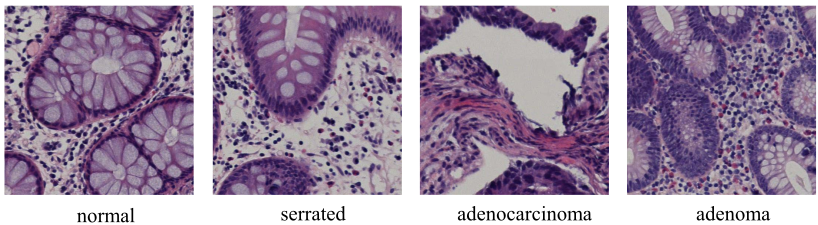

# Categorización de imágenes de histopatología

`(C) 2022- Francisco José Madrid Cuevas, Universidad de Córdoba.`

Esta práctica consitirá en entrenar un clasificador para que clasifique imágenes
de histopatología como las mostradas en la Figura 1.



El Dataset y referencias originales las puedes consultar [aquí](https://bupt-ai-cz.github.io/HSA-NRL/).

El dataset proporcionado será una versión del original rescalada para reducir su espacio en disco consistente en imágenes de 128x128 en color.

## Primera semana

Lo primero que tienes que hacer es descargar el código de la práctica y configurar el proyecto. Se ha añadido soporte OpenMP para realizar en paralelo la extracción de características. Utiliza la opción `-DWITH_OPENMP=yes` al configurar el proyecto con `cmake`.

Lo siguiente que tienes que hacer es codificar las funciones `fsiv_xxxx` para superar los test de `test_common_code`.

En la primera semana al menos debes codificar las funciones que calculan las métricas más los test para crear, guardar y cargar un clasificador K-NN.

Se ha entregado con el código un extractor que extrae como características una versión en niveles de gris $[0,1]$ de la imagen en color redimensionada a un tamaño $S \times S$ con valor por defecto $S=16$.

Con esto puedes empezar a entrenar un clasificador K-NN. Se sugiere usar una división 80/20 del conjunto de entrenamiento para poder validar y ajustar los hiperparámetros $S$ y $K$.

## Segunda semana

Añade otros clasificadores como SVM o RTrees y entrénalos para ver si puedes mejorar los resultados. Para ello deberías implementar y pasar los test de creación, cargar y guardar para el clasificador elegido.

Además también puedes probar a crear tu propio extractor de características aplicando todo lo visto sobre procesado y análisis de imágenes.

## Como creo mi extractor de características

Hay una clase base [`FeaturesExtractor`](/features.hpp) definida en `features.hpp` de la que debe heredar tu extractor. Puedes usar como plantilla el extractor [`GrayLevelsFeatures`](/gray_levels_features.hpp) definido en `gray_levels_features.hpp` y `gray_levels_features.cpp`.

Supon que quieres defininir un nuevo extractor que llamaremos `MiExtractor`. Copia los ficheros  `gray_levels_features.hpp` y `gray_levels_features.cpp` con los nuevos nombres `mi_extractor.hpp` y `mi_extractor.cpp` respectivamente.

Ahora sustituye el nombre de la clase `GrayLevelsFeatures` por `MiExtractor` en ambos ficheros.

A continuación debes añadir en `features.hpp`  una nueva constante al enumerado `FEATURE_IDS`, usando el siguiente entero libre para identificar tu extractor:

```c++
typedef enum {
    FSIV_NON_EXTRACTOR=0, //None extractor is used.
    FSIV_GREY_LEVELS=1, // Use pixel grey levels [0,1].
    FSIV_MI_EXTRACTOR=2,
    //TODO: Add new features to extract.
    //FSIV_XXXXX=2,
    //FSIV_YYYYY=3,
    //....
} FEATURE_IDS;
```

En el fichero `features.cpp` debes añadir dos cambios:

1. Debes incluir el fichero de cabeceras `mi_extractor.hpp`

```c++
// TODO: add the include for each extractor to use.
// Hint: use gray_levels_features.hpp and gray_levels_features.cpp as model to
//   make yours.
#include "gray_levels_features.hpp"
#include "mi_extractor.hpp"
//#inlude "xxxxxx.hpp"

// Remenber: update CMakeLists.txt with the new files.
//
```

2. Debes añadir la creación de una instancia de tu extractor en el método `FeaturesExtractor::create()`:

```c++
cv::Ptr<FeaturesExtractor> FeaturesExtractor::create(FEATURE_IDS id)
{
    cv::Ptr<FeaturesExtractor> extractor;
    switch (id) {
        case FSIV_GREY_LEVELS:
        {
            extractor = cv::makePtr<GrayLevelsFeatures>();
            break;
        }
        case FSIV_MI_EXTRACTOR:
        {
            extractor = cv::makePtr<MiExtractor>();
            break;
        }

        // TODO: add here 'cases' for your features.
        // case FSIV_XXXXX: {
        //    extractor = cv::makePtr<FeatureExtractor>(new XXXXX());
        //    break;
        // }
        //
```
Además en el fichero de projecto `CMakeLists.txt` debes añadir a la librería `common_code` los ficheros que acabas de crear con la definción de tu extractor:

```cmake
add_library(common_code STATIC
    common_code.hpp
    dataset.cpp dataset.hpp
    classifiers.cpp classifiers.hpp
    metrics.cpp metrics.hpp
    features.cpp features.hpp
    gray_levels_features.hpp gray_levels_features.cpp
    mi_extractor.hpp mi_extractor.cpp
#TODO: add your feature extractors files here.
)
```

Ahora sólo falta que escribas el código de la implementación de tu extractor. Por ejemplo puedes probar a ecualizar primero e introducir color, usar histogramas, o una característica de textura como el LBP, HOG, etc. Como ves tienes muchas alternativas.

Recuerda que tienes un vector de parámetros que se cargan desde la línea de comandos y son necesarios para parametrizar tu descriptor (por ejemplo el parámetro $S$ en el extractor de niveles de gris.)

Hay tres métodos con una implementación por defecto relativos al entrenamiento del extractor. Si no necesitas entrenar tu extractor no hace falta que los redefinas.

## Evaluación

La práctica se evaluará de la siguiente forma:
* Hasta 7 puntos proporcionalmente al nuḿero de tests superados respecto al total.
* Los otros tres puntos se darán en función del trabajo extra realizado, como por ejemplo:
  - Otros extractores de características.
  - Memoria pdf con con análisis usando gráficos y tablas de los modelos y los hiperparámetros entrenados.
